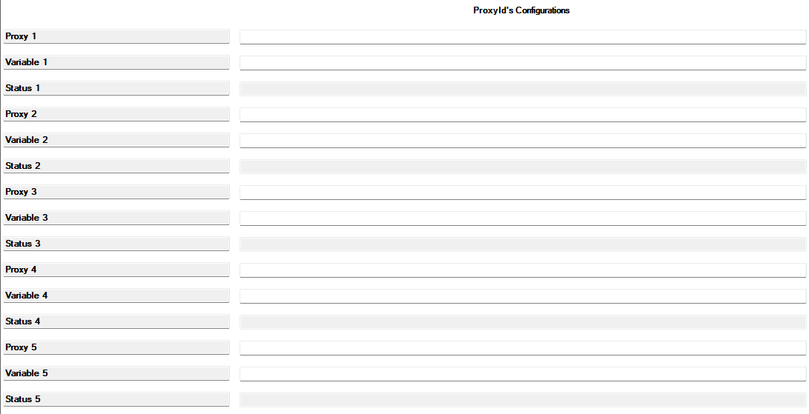
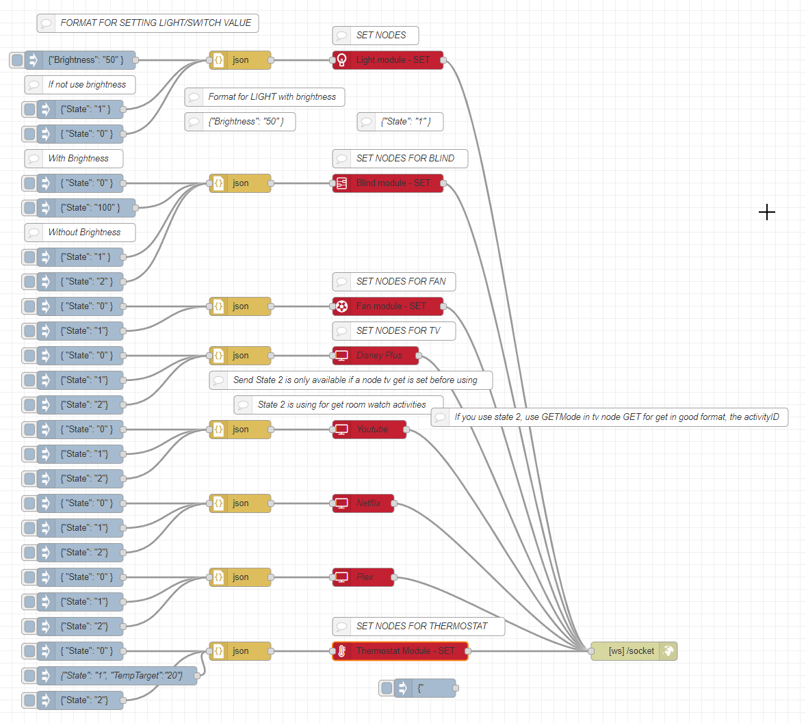

  
  

---

A problem solver driver for Control4, connect Control4 to anything via Node-Red.

# WebSocket Way Control4 Driver to Node-red

You want to link tuya with control4, home-made devices, something else? With this driver you can simulate devices in control4, control existing devices from node-red.

## IMPORTANT

Name change to not match another incredible project by [itsfrosty/control4-2way-web-driver](https://github.com/itsfrosty/control4-2way-web-driver), the file name can prevent its use to facilitate the use of the section "ProxyId’s configurations, since the itsfrosty driver can recover all the variables of a proxyId linked to control4 (Not the variableId present in my documentation, API section), you can deduce by changing the states of your devices, which variableId correspond to the desired action and use it to retrieve states via my agents. [Go to If my devices isn't supported by the devices selector section ?](#Isns)

Refer to his documentation to further informations. 

**Caution**
Normally this upgrade is also painless, make sure the socket is reconnected and that’s okay, if you encounter a problem, please remove the driver and put it back, otherwise open an [issue](https://github.com/CdriFry/C4_WS2NR/issues)

## Installation

If you do not have access to ComposerPro, ask your dealer to install the driver, to subscribe to the desired devices. All you have to do is listen to the status changes on node-red

To install the driver control4, in ComposerPro go to Driver > Add or Update Driver or Agent.
Go to agent and add it.

## Usage

See doc.

## If my devices isn't supported by the devices selector section ? {#Isns}

In order to try to recover the states of a device that is not yet supported, you can use the itsfrosty driver to recover the variablesIds of your devices by swapping the states and observing the variables that change.

Once done, add the variablesId in the ProxyId’s Configurations section to save them, then go to "Action > Register listeners", you should see the status changes in node-red.

Unfortunately, Directly Changing Control Variables 4 is not a few things to recommend, it is something that could potentially block some director actions by returning false information. [Ask to add devices types compatiblity](https://github.com/CdriFry/C4_WS2NR/issues)

  

  This section is dedicated to this practice.
  
  Be careful in this section, use ONLY the control4 variableids, so the one returned by the web2way driver by itsfrosty for example, otherwise see in  [Snap One Documentation Proxy Protocol](https://snap-one.github.io/docs-driverworks-proxyprotocol/)

## Tips

You can add generic lamps to imitate the lamps that you want to add from node-red, this allows you to view these devices from control4 and in the navigators, just add it, to retrieve the proxyID of your generic lamp and subscribe to it in the agents, you can then act as if this lamp were your controlled lamp via node-red.

## Example

  

## Licence

Nodes are open-sources, the control4 driver is not..

## Coming soon

&#10060;Color for light.
&#10060;Control of activities Listen

## Added

&#10004;Control of Activities Watch
&#10004;Debug to get variableId
&#10004;Change name to not collision with the work of itsfrosty

## Licence Key

Once you have successfully tested my driver, that you are sure it can serve you, if you want to continue using it, you can contact me by [E-mail](mailto:cedric@soundimage.be) to get a valid key

Be aware that this driver has distributed you in the state, be sure that the driver suits you before contacting me.
